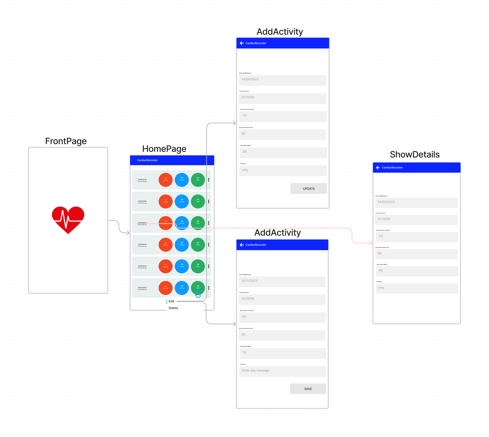

# Cardiac Recorder

Monitor your blood pressure and heart rate data in a simple, attractive, intuitive mobile app and track this data.

## Objectives
* To track Systolic and diastolic pressure
* To track Heart Rate
* To keep track of data with date and timewise

## UML Design

## Mockup Design

## 🔗 Links

	

